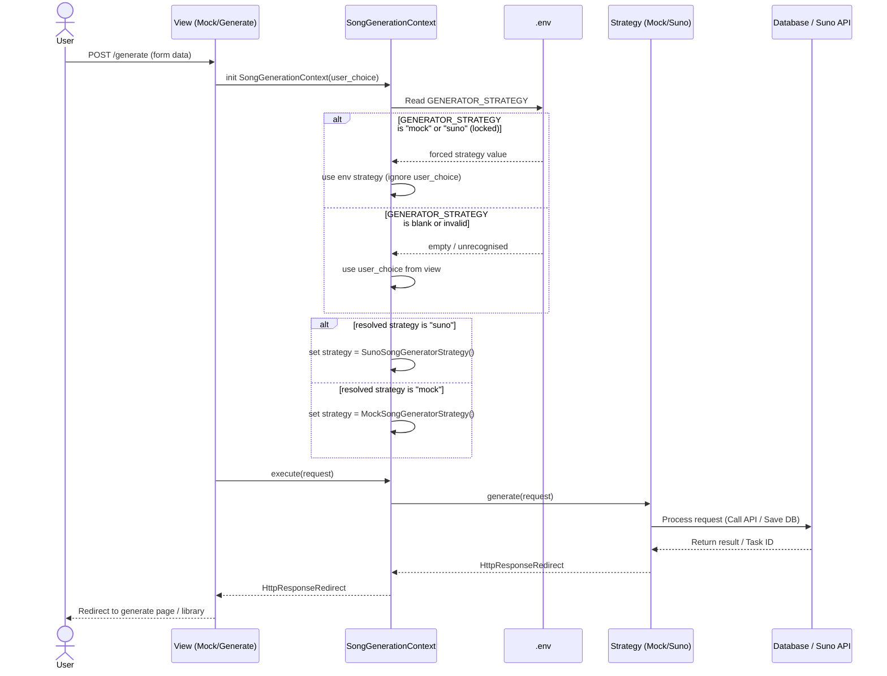

# 🎵 SongGTP CRUD Application

A Django-based CRUD (Create, Read, Update, Delete) web application for managing SongGTP data.  
This project demonstrates backend development using Django and Django Admin for rapid data management.

---

## 🚀 Getting Started

Follow the steps below to run the project locally.

---

## 1. Clone the Repository

```bash
git clone https://github.com/JirakornChaitanaporn/songGTP_CRUD.git
cd songGTP_CRUD
```
## 2. Create a Virtual Environment
macOS / Linux:
```bash
python3 -m venv .env
```
Windows:
```bash
python -m venv .env
```
## 3. Activate the Virtual Environment
macOS / Linux:
```bash
source .env/bin/activate
```
Windows
```bash
.env\Scripts\activate
```
## 4. Install Dependencies
```bash
pip install -r requirements.txt
```
## 5. Configure Environment Variables

Before running the app, copy the example env file and fill in your own values:

```bash
cp .env.example .env
```

Then open `.env` and fill in each variable. See the table and guides below.

### 📋 Variable Reference

| Variable | Description | Required |
|---|---|---|
| `SUNO_API_KEY` | Your Suno API key for real song generation | Only for `suno` strategy |
| `GENERATOR_STRATEGY` | Generation strategy: `mock` or `suno` | ✅ Yes |
| `GOOGLE_OAUTH_CLIENT_ID` | Google OAuth 2.0 Client ID | ✅ Yes |
| `GOOGLE_OAUTH_CLIENT_SECRET` | Google OAuth 2.0 Client Secret | ✅ Yes |
| `BASE_URL` | Base URL of your local server (default: `http://localhost:8000/`) | ✅ Yes |

---

### 🔑 How to Get Your Google OAuth Credentials

Follow these steps to create a Google OAuth 2.0 client for local development:

**Step 1 — Go to Google Cloud Console**
- Visit [https://console.cloud.google.com/](https://console.cloud.google.com/)
- Sign in with your Google account.

**Step 2 — Create or Select a Project**
- Click the project dropdown at the top.
- Click **"New Project"**, give it a name (e.g. `SongGTP`), and click **"Create"**.

**Step 3 — Enable the OAuth Consent Screen**
1. In the left sidebar, go to **APIs & Services → OAuth consent screen**.
2. Choose **External** (so any Google account can log in) and click **"Create"**.
3. Fill in the required fields:
   - **App name**: `SongGTP`
   - **User support email**: your email
   - **Developer contact email**: your email
4. Click **"Save and Continue"** through the remaining steps (Scopes, Test users) — defaults are fine for local dev.

**Step 4 — Create OAuth 2.0 Credentials**
1. Go to **APIs & Services → Credentials**.
2. Click **"+ Create Credentials"** → **"OAuth client ID"**.
3. Set **Application type** to **Web application**.
4. Give it a name (e.g. `SongGTP Local`).
5. Under **Authorised redirect URIs**, add:
   ```
   http://localhost:8000/accounts/google/login/callback/
   ```
6. Click **"Create"**.
7. A dialog will show your **Client ID** and **Client Secret** — copy both.

**Step 5 — Paste into `.env`**
```env
GOOGLE_OAUTH_CLIENT_ID="your-client-id-here.apps.googleusercontent.com"
GOOGLE_OAUTH_CLIENT_SECRET="your-client-secret-here"
```

---

### 🎵 Choosing a Generation Strategy (`GENERATOR_STRATEGY`)

This project supports two song generation strategies:

| Value | Behaviour |
|---|---|
| `mock` | Generates a fake song instantly using placeholder data — no API key needed, great for testing |
| `suno` | Calls the real Suno API to generate actual songs — requires a valid `SUNO_API_KEY` |

#### ⚙️ How `GENERATOR_STRATEGY` Works

The strategy is resolved with the following priority:

```
.env GENERATOR_STRATEGY set to "mock" or "suno"  →  always uses that strategy (locked)
.env GENERATOR_STRATEGY is blank or invalid       →  user chooses via the toggle button in the UI
```

| `.env` value | Who controls the strategy | Toggle button in UI |
|---|---|---|
| `mock` | `.env` (locked) | Disabled |
| `suno` | `.env` (locked) | Disabled |
| *(blank)* | User (via UI toggle) | Enabled |
| *(invalid value)* | Falls back to user choice | Enabled |

**Lock the strategy via `.env` (recommended for production / CI):**
```env
GENERATOR_STRATEGY="suno"   # always uses Suno API regardless of what user clicks
GENERATOR_STRATEGY="mock"   # always uses mock regardless of what user clicks
```

**Let the user choose in the UI (recommended for local dev):**
```env
GENERATOR_STRATEGY=          # leave blank — toggle button in the form will be enabled
```

**To get a Suno API Key:**
1. Visit [https://sunoapi.org/](https://sunoapi.org/) and sign up.
2. Copy your API key from the dashboard.
3. Paste it into `.env`:
   ```env
   SUNO_API_KEY="your-suno-api-key-here"
   GENERATOR_STRATEGY="suno"
   ```

For local testing without a Suno account:
```env
GENERATOR_STRATEGY="mock"
```

### 🧠 Using the Strategy Pattern in Code

The application dynamically selects how to generate songs via `SongGenerationContext`. The resolution order is:

1. **`.env` takes priority** — if `GENERATOR_STRATEGY` is set to `"mock"` or `"suno"`, that strategy is always used no matter what.
2. **User's choice (view arg) is the fallback** — if `.env` is blank or contains an unrecognised value, the strategy passed by the view is used instead.
3. **Default** — if both are absent, falls back to `"mock"`.

```python
# Context.py — resolution logic
env_strategy = os.getenv("GENERATOR_STRATEGY", "").strip().lower()
chosen = (env_strategy if env_strategy in {"mock", "suno"} else (user_choice or "mock"))
```

The views pass their intended strategy as the fallback:
```python
# CreateGenerateSongView.py  — user's intended choice is "suno"
context = SongGenerationContext("suno")

# CreatePromptMockupView.py  — user's intended choice is "mock"
context = SongGenerationContext("mock")
```

To inspect which strategy and lock-state are active (used to drive the UI):
```python
strategy, is_forced = SongGenerationContext.resolve("suno")
# strategy  → "mock" or "suno"
# is_forced → True if .env is controlling it, False if user can switch
```

---

## 🎨 Architecture & Design Patterns

### 🏗️ Class Diagram (Codebase Architecture & Strategy Pattern)
This diagram illustrates the classes exactly as they exist in the Django codebase, covering Models, Views, and the Strategy Pattern.

```mermaid
classDiagram
    namespace Django_Template {
        class login_html {
            <<Template>>
        }
        class library_html {
            <<Template>>
        }
        class generate_song_html {
            <<Template>>
        }
        class prompt_table_html {
            <<Template>>
        }
        class song_html {
            <<Template>>
        }
        class song_public_html {
            <<Template>>
        }
    }

    namespace Django_View {
        class UserLoginView {
            +get(request)
            +post(request)
        }
        class GoogleOAuthRedirectView {
            +get(request)
        }
        class LogoutView {
            +get(request)
        }
        class CreateLibraryView {
            +get(request)
            +post(request)
        }
        class LibraryView {
            +get(request)
        }
        class SearchLibraryView {
            +get(request)
        }
        class DeleteLibraryView {
            +get(request)
            +post(request)
        }
        class UpdateLibraryView {
            +get(request)
            +post(request)
        }
        class CreatePromptMockupView {
            +get(request)
            +post(request)
        }
        class CreateGenerateSongView {
            +get(request)
            +post(request)
        }
        class ShowPrompt {
            +get(request)
        }
        class SunoStatusViewController {
            +get(request, tid, uid)
        }
        class DeleteSongView {
            +get(request)
        }
        class GetSongView {
            +get(request, pk)
        }
        class PatchSharingStatusView {
            +post(request, pk)
        }
        class GetPublicSongView {
            +get(request)
        }
        class GetDownloadSongView {
            +get(request, pk)
        }
    }

    namespace Django_Model {
        class AbstractUser {
            <<Django Model>>
        }
        class Model {
            <<Django Model>>
        }
        class User {
            +id : int
            +username : str
            +email : str
            +created_at : datetime
        }
        class Library {
            +id : int
            +user_id : int
            +created_at : datetime
        }
        class Prompt {
            +id : int
            +task_id : str
            +user_id : int
            +song_name : str
            +song_genre : str
            +song_mood : str
            +generation_status : str
            +description : str
            +lyrics : str
            +keywords : str
            +created_at : datetime
        }
        class Song {
            +id : int
            +prompt_id : int
            +library_id : int
            +song_name : str
            +image_link : str
            +song_url : str
            +shared_code : str
            +sharing_status : str
            +description : str
            +lyrics : str
            +length : str
            +created_at : datetime
        }
        class Mood {
            <<TextChoices>>
            HAPPY, SAD, ROMANTIC, ANGRY, ENERGETIC, CALM
        }
        class Genre {
            <<TextChoices>>
            POP, ROCK, HEAVY_METAL, SOFT_ROCK, POP_ROCK, COUNTRY
        }
        class Generation {
            <<TextChoices>>
            PENDING, TEXT_SUCCESS, FIRST_SUCCESS, SUCCESS, ERROR
        }
        class Status {
            <<TextChoices>>
            PUBLIC, PRIVATE
        }
    }

    namespace Strategy_Pattern {
        class SongGenerationContext {
            -_strategy : SongGenerationStrategy
            +__init__()
            +execute(request)
        }
        class SongGenerationStrategy {
            <<ABC>>
            +generate(request)*
        }
        class MockSongGeneratorStrategy {
            +generate(request)
        }
        class SunoSongGeneratorStrategy {
            +generate(request)
        }
    }

    %% Inheritance
    AbstractUser <|-- User
    Model <|-- Library
    Model <|-- Prompt
    Model <|-- Song

    %% Model Associations
    User "1" -- "1" Library : has
    User "1" -- "0..*" Prompt : has
    Library "1" -- "0..*" Song : has
    Prompt "1" -- "1" Song : has

    %% Template to View Relationships
    login_html ..> UserLoginView : HTTP
    login_html ..> GoogleOAuthRedirectView : HTTP
    
    library_html ..> LibraryView : HTTP
    library_html ..> CreateLibraryView : HTTP
    library_html ..> SearchLibraryView : HTTP
    library_html ..> DeleteLibraryView : HTTP
    library_html ..> UpdateLibraryView : HTTP
    library_html ..> LogoutView : HTTP
    
    generate_song_html ..> CreatePromptMockupView : HTTP
    generate_song_html ..> CreateGenerateSongView : HTTP
    
    prompt_table_html ..> ShowPrompt : HTTP
    
    song_html ..> GetSongView : HTTP
    song_html ..> DeleteSongView : HTTP
    song_html ..> PatchSharingStatusView : HTTP
    song_html ..> GetDownloadSongView : HTTP
    
    song_public_html ..> GetPublicSongView : HTTP

    %% View to Model Relationships
    UserLoginView ..> User : access
    GoogleOAuthRedirectView ..> User : access
    
    LibraryView ..> Library : access
    CreateLibraryView ..> Library : access
    SearchLibraryView ..> Library : access
    DeleteLibraryView ..> Library : access
    UpdateLibraryView ..> Library : access
    
    CreatePromptMockupView ..> Prompt : access
    CreateGenerateSongView ..> Prompt : access
    ShowPrompt ..> Prompt : access
    SunoStatusViewController ..> Prompt : access
    SunoStatusViewController ..> Song : access
    
    GetSongView ..> Song : access
    DeleteSongView ..> Song : access
    PatchSharingStatusView ..> Song : access
    GetPublicSongView ..> Song : access

    %% Strategy Pattern Relationships
    CreatePromptMockupView ..> SongGenerationContext : uses
    CreateGenerateSongView ..> SongGenerationContext : uses
    SongGenerationContext o-- SongGenerationStrategy : configures
    MockSongGeneratorStrategy ..|> SongGenerationStrategy : implements
    SunoSongGeneratorStrategy ..|> SongGenerationStrategy : implements
```



### 🔄 Sequence Diagram (Song Generation Flow)
The following sequence diagram shows the execution flow when a user requests to generate a song:


