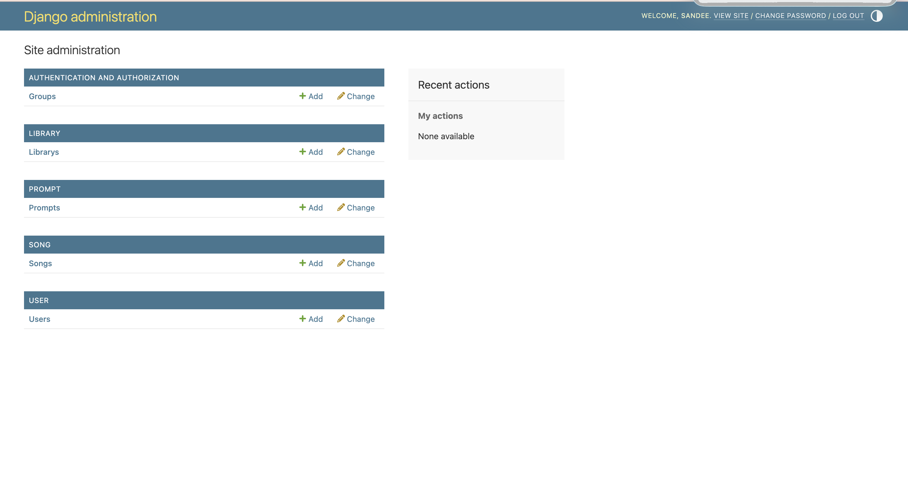
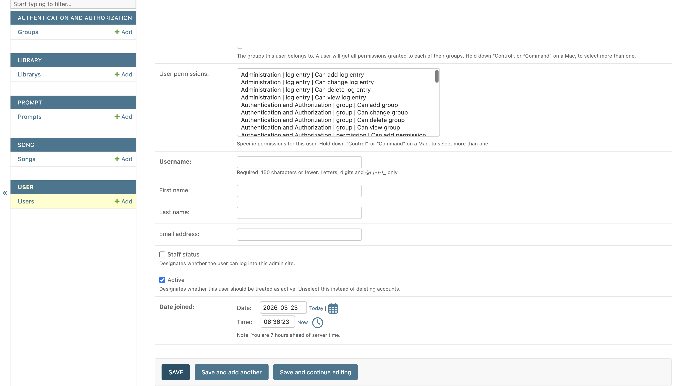
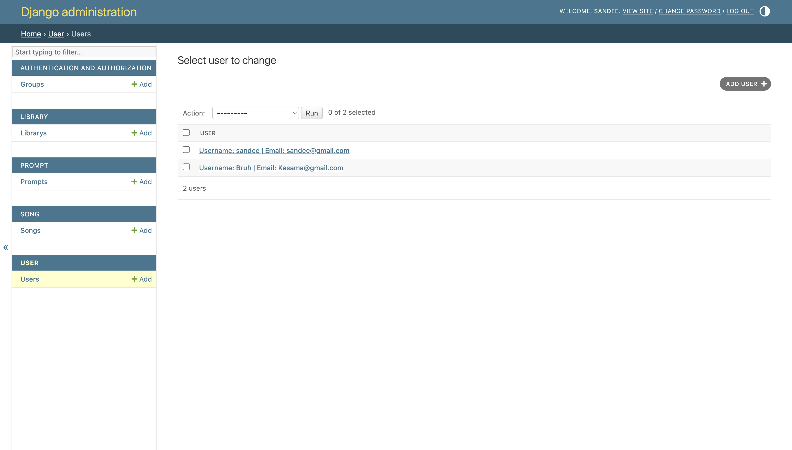
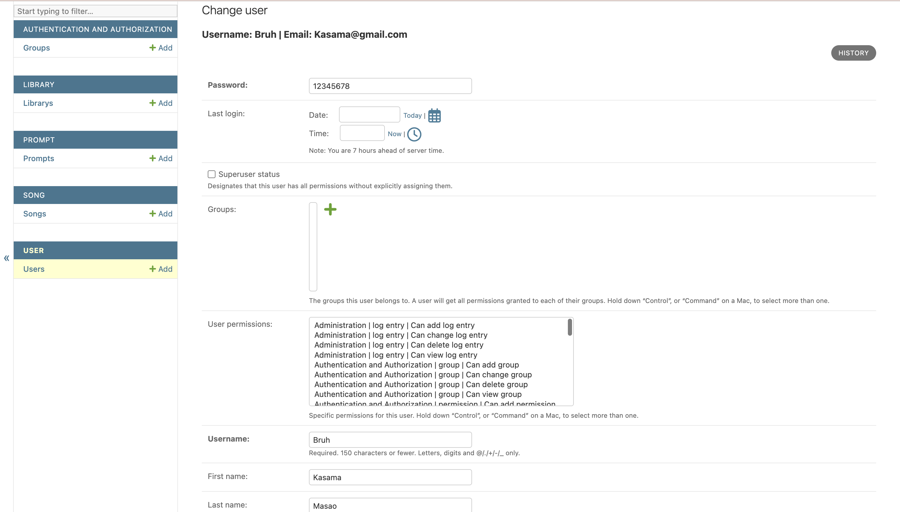
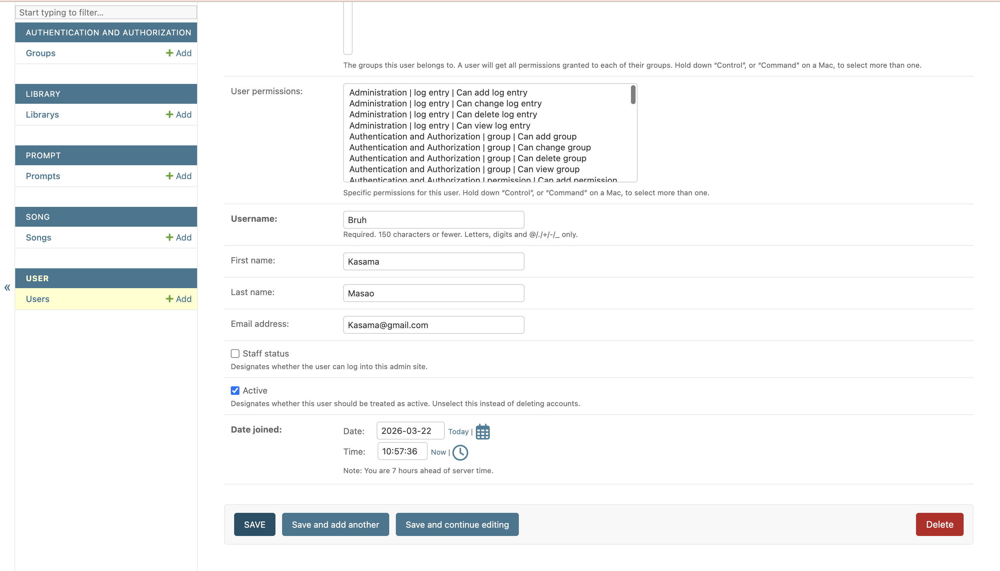
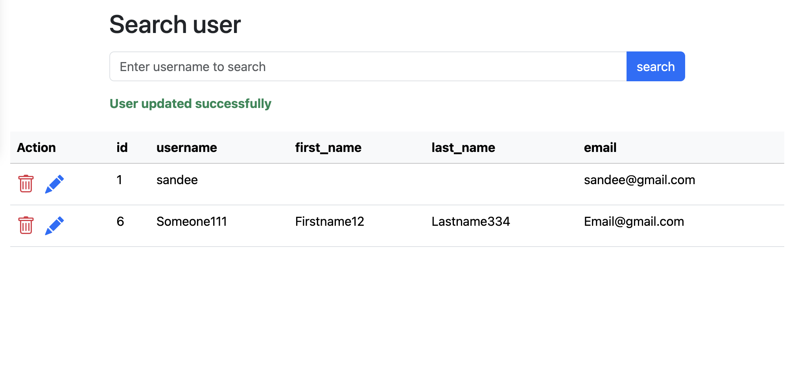
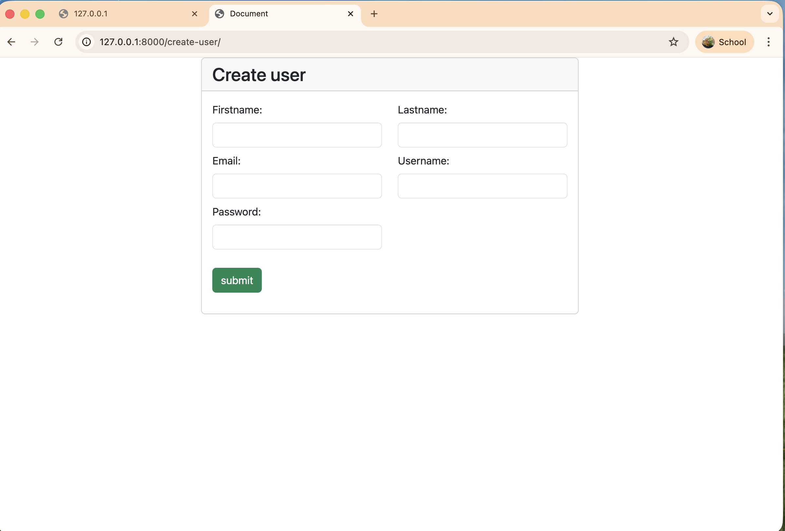
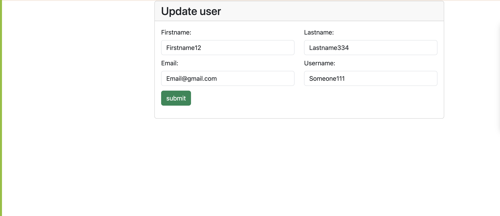

# 🎵 SongGTP CRUD Application

A Django-based CRUD (Create, Read, Update, Delete) web application for managing SongGTP data.  
This project demonstrates backend development using Django and Django Admin for rapid data management.

---

## 🚀 Getting Started

Follow the steps below to run the project locally.

---

## 1. Clone the Repository

```bash
git clone https://github.com/JirakornChaitanaporn/songGTP_CRUD.git
cd songGTP_CRUD
```
## 2. Create a Virtual Environment
macOS / Linux:
```bash
python3 -m venv .env
```
Windows:
```bash
python -m venv .env
```
## 3. Activate the Virtual Environment
macOS / Linux:
```bash
source .env/bin/activate
```
Windows
```bash
.env\Scripts\activate
```
## 4. Install Dependencies
```bash
pip install -r requirements.txt
```
## 5. Configure Environment Variables

Before running the app, copy the example env file and fill in your own values:

```bash
cp .env.example .env
```

Then open `.env` and fill in each variable. See the table and guides below.

### 📋 Variable Reference

| Variable | Description | Required |
|---|---|---|
| `SUNO_API_KEY` | Your Suno API key for real song generation | Only for `REAL` strategy |
| `STRAT_CHOSEN` | Generation strategy: `MOCK` or `REAL` | ✅ Yes |
| `GOOGLE_OAUTH_CLIENT_ID` | Google OAuth 2.0 Client ID | ✅ Yes |
| `GOOGLE_OAUTH_CLIENT_SECRET` | Google OAuth 2.0 Client Secret | ✅ Yes |
| `BASE_URL` | Base URL of your local server (default: `http://localhost:8000/`) | ✅ Yes |

---

### 🔑 How to Get Your Google OAuth Credentials

Follow these steps to create a Google OAuth 2.0 client for local development:

**Step 1 — Go to Google Cloud Console**
- Visit [https://console.cloud.google.com/](https://console.cloud.google.com/)
- Sign in with your Google account.

**Step 2 — Create or Select a Project**
- Click the project dropdown at the top.
- Click **"New Project"**, give it a name (e.g. `SongGTP`), and click **"Create"**.

**Step 3 — Enable the OAuth Consent Screen**
1. In the left sidebar, go to **APIs & Services → OAuth consent screen**.
2. Choose **External** (so any Google account can log in) and click **"Create"**.
3. Fill in the required fields:
   - **App name**: `SongGTP`
   - **User support email**: your email
   - **Developer contact email**: your email
4. Click **"Save and Continue"** through the remaining steps (Scopes, Test users) — defaults are fine for local dev.

**Step 4 — Create OAuth 2.0 Credentials**
1. Go to **APIs & Services → Credentials**.
2. Click **"+ Create Credentials"** → **"OAuth client ID"**.
3. Set **Application type** to **Web application**.
4. Give it a name (e.g. `SongGTP Local`).
5. Under **Authorised redirect URIs**, add:
   ```
   http://localhost:8000/accounts/google/login/callback/
   ```
6. Click **"Create"**.
7. A dialog will show your **Client ID** and **Client Secret** — copy both.

**Step 5 — Paste into `.env`**
```env
GOOGLE_OAUTH_CLIENT_ID="your-client-id-here.apps.googleusercontent.com"
GOOGLE_OAUTH_CLIENT_SECRET="your-client-secret-here"
```

---

### 🎵 Choosing a Generation Strategy (`STRAT_CHOSEN`)

This project supports two song generation strategies:

| Value | Behaviour |
|---|---|
| `MOCK` | Generates a fake song instantly using placeholder data — no API key needed, great for testing |
| `REAL` | Calls the real Suno API to generate actual songs — requires a valid `SUNO_API_KEY` |

**To get a Suno API Key:**
1. Visit [https://sunoapi.org/](https://sunoapi.org/) and sign up.
2. Copy your API key from the dashboard.
3. Paste it into `.env`:
   ```env
   SUNO_API_KEY="your-suno-api-key-here"
   STRAT_CHOSEN="REAL"
   ```

For local testing without a Suno account, just use:
```env
STRAT_CHOSEN="MOCK"
```

---

## 6. Apply Database Migrations
```bash
python manage.py makemigrations
python manage.py migrate
```
## 7. Create a Superuser
```bash
python manage.py createsuperuser
```

Enter your preferred username, email, and password when prompted.

## 8. Run the Development Server
python manage.py runserver
🌐 Access the Admin site:
Admin url:
http://127.0.0.1:8000/admin/

Log in using the superuser credentials you created earlier.

## 8. Using CRUD in the Admin Site

After logging in, you will be redirected to the admin dashboard:



---

### ➕ Create Data
To create new data:
1. Click the **"Add"** button.
2. Fill in the required fields.
3. Click **"Save"** at the bottom.



---

### 📖 Read Data
To view existing data:
- Click on a table name such as:
  - **Librarys**
  - **Prompts**
  - **Songs**
  - **Users**



---

### ✏️ Update Data
To update existing data:
1. Click **"Change"**.
2. Select the row you want to edit.
3. Modify the information.
4. Click **"Save"**.



---

### ❌ Delete Data
To delete data:
1. Click on a table name:
   - **Librarys**
   - **Prompts**
   - **Songs**
   - **Users**
2. Select the row you want to delete.
3. Click **"Delete"** at the bottom right.



## 8.1 Alternative CREATE & READ (Template Views)

In addition to the Admin site, you can use the **template-based frontend** to create and search data directly in the browser.

### 🔧 Setup

Run the development server as usual:

```bash
python manage.py runserver
```

### 🔗 Available Routes

The URL format follows: `http://127.0.0.1:8000/<operation>-<table>/`

| Operation | Table | URL |
|-----------|-------|-----|
| **Create** | User | [/create-user/](http://127.0.0.1:8000/create-user/) |
| **Search** | User | [/search-user/](http://127.0.0.1:8000/search-user/) |
| **Create** | Song | [/create-song/](http://127.0.0.1:8000/create-song/) |
| **Search** | Song | [/search-song/](http://127.0.0.1:8000/search-song/) |
| **Create** | Library | [/create-library/](http://127.0.0.1:8000/create-library/) |
| **Search** | Library | [/search-library/](http://127.0.0.1:8000/search-library/) |
| **Create** | Prompt | [/create-prompt/](http://127.0.0.1:8000/create-prompt/) |
| **Search** | Prompt | [/search-prompt/](http://127.0.0.1:8000/search-prompt/) |
| **Update** | User | [/update-user/](http://127.0.0.1:8000/update-user/) |
| **Delete** | User | [/delete-user/](http://127.0.0.1:8000/delete-user/) |
| **Update** | Song | [/update-song/](http://127.0.0.1:8000/update-song/) |
| **Delete** | Song | [/delete-song/](http://127.0.0.1:8000/delete-song/) |
| **Update** | Library | [/update-library/](http://127.0.0.1:8000/update-library/) |
| **Delete** | Library | [/delete-library/](http://127.0.0.1:8000/delete-library/) |
| **Update** | Prompt | [/update-prompt/](http://127.0.0.1:8000/update-prompt/) |
| **Delete** | Prompt | [/delete-prompt/](http://127.0.0.1:8000/delete-prompt/) |

---

### 📝 Create Example

Fill in the form fields and click **"Submit"** to create a new record.



---

### 🔍 Search Example

Use the search bar to filter records by name (e.g. username, song name). Leave it empty to view all records.



> **Note:** For the **Search** pages, you can type a keyword to filter results (e.g. username, song name).  
> For the **Create** pages, simply fill in the fields and submit the form.

###  Delete row
Use the bin icon on the left and click it then click ok

###  Update row

Click on pencil icon and you will be redirect to update page
Enter all updated information there
